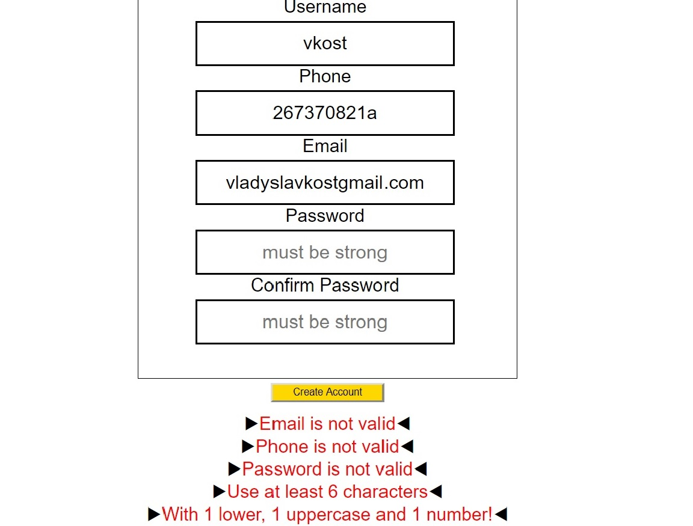
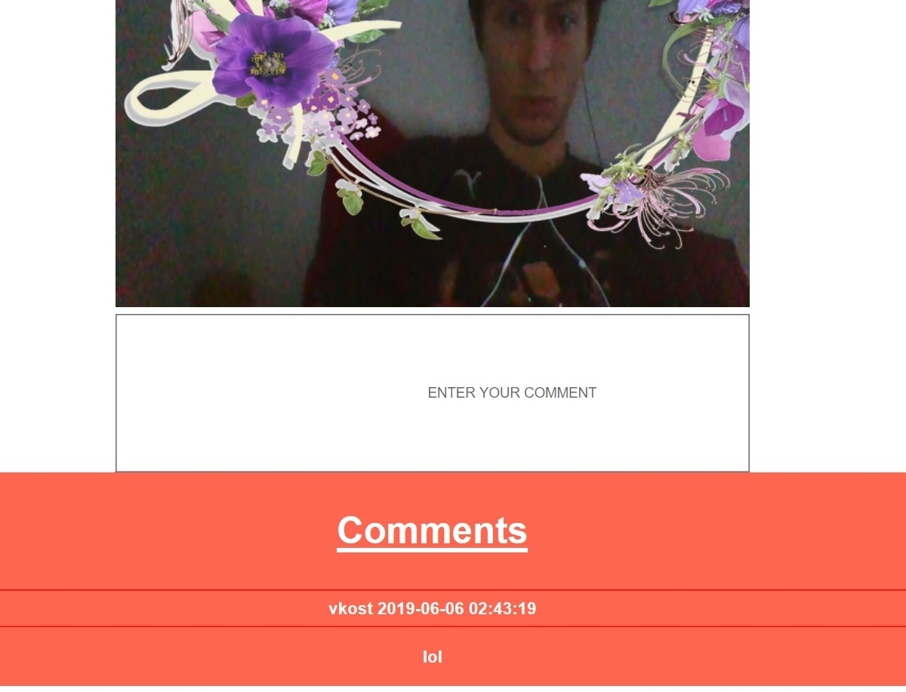

# Camagru-instagram-
school project(Web) Main goal of this project was to combine all knowledge from PHP piscine(PHP,JS,MySQL,HTML and CSS) and create something similar to Instagram

Main page

Registration

Validation

Camera setup

Comments

Account

JUST FOR FUN)

